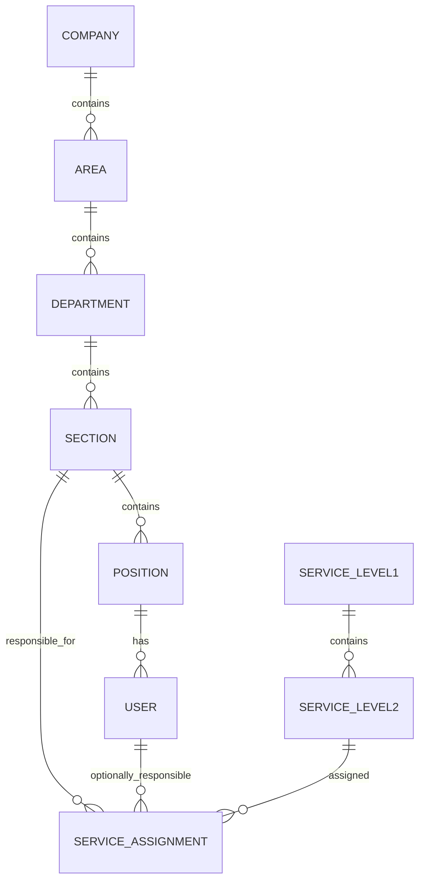

# Resolución de la tarea

## Estado del documento

Este documento es la narración principal del proyecto. Se actualiza con resultados reales y enlaza a las evidencias de respaldo. Los apartados que todavía no tienen implementación se marcan como pendientes.

## 1. Problema, alcance y supuestos

La organización administra sus servicios de TI en un Excel y necesita una aplicación web para consultar y mantener el catálogo, organizar usuarios y unidades, y asignar responsables.

El alcance incluye:

- Autenticación local y dos roles.
- Jerarquía Empresa → Área → Departamento → Sección → Puesto → Usuario.
- Catálogo de servicios nivel 1 y nivel 2.
- Importación repetible del Excel.
- Asignación de servicios a secciones y usuarios responsables.
- Docker, PostgreSQL, pruebas y documentación reproducible.

No se implementarán tickets, facturación ni consumo de servicios porque están fuera del alcance del parcial.

## 2. Arquitectura y justificación de tecnologías

Se utilizará un monolito modular con MVC por capas, Service y Repository:

```text
React/Vite -> Handler/Controller -> Service -> Repository -> PostgreSQL
```

- React/Vite organiza la vista por funcionalidades.
- Go concentra la API y las reglas de negocio.
- Los Services validan permisos, relaciones y reglas del catálogo.
- Los Repositories encapsulan las consultas SQL.
- PostgreSQL conserva los datos y la persistencia.
- Docker Compose reproducirá la aplicación y la base de datos.

Las bajas son lógicas. El servidor impide desactivar una unidad que todavía tenga dependencias activas y evita desactivar usuarios que continúan como responsables de servicios. Primero debe corregirse la relación.

## 3. Modelo entidad-relación y diccionario de datos

El esquema inicial ya está implementado en `backend/migrations/001_initial_schema.sql`. La estructura base es:



Tablas previstas:

| Entidad | Restricciones principales |
|---|---|
| Empresa | Código único y estado |
| Área | Código único dentro de la empresa |
| Departamento | Código único dentro del área |
| Sección | Código único dentro del departamento |
| Puesto | Código único dentro de la sección |
| Usuario | Usuario/correo único, rol, estado y puesto |
| Servicio nivel 1 | Código único y nombre canónico |
| Servicio nivel 2 | Código único, nivel 1 obligatorio y atributos del Excel |
| Asignación | Servicio, sección y usuario opcional de la misma sección |
| Observación de importación | Hoja, fila, rango, regla y mensaje |

La ficha de cada servicio muestra el código, los nombres del nivel 1 y nivel 2,
el indicador de activo del Excel, el estado del registro, clase, criticidad,
tipo, descripción, métrica, mínimo, máximo, estado de revisión y asignación.

## 4. Mapeo Excel → base de datos

La fuente original se conserva en `data/CatalogoServicios.xlsx` y no se modifica.

- Encabezados: `A4:L4`.
- Datos: `A5:L101`.
- Opciones: `E112:H122`.
- Resultado esperado: 12 códigos de nivel 1 y 46 códigos de nivel 2.
- Las reglas completas están en [001-reglas-importacion-catalogo.md](decisiones/001-reglas-importacion-catalogo.md).
- El primer reporte real está en [import-report.json](../outputs/import-report.json).

### Reglas especiales

1. Las celdas combinadas se resuelven desde su celda principal y únicamente dentro de su rango.
2. Una fila nivel 2 se crea solo cuando `COD.N2` existe físicamente o es la celda principal de una combinación.
3. `SE.12` conserva como nombre canónico el primer valor encontrado: `Suministrar Analitica`.
4. `Mantener Tableros de Control` se conserva como evidencia del conflicto de la fila 100.
5. `SE.12.1`, `SE.12.2` y `SE.12.3` se mantienen como texto.
6. El padre de un nivel 2 se obtiene del prefijo del código, sin copiar nombres de filas vecinas.
7. Los atributos vacíos de las filas 99 a 101 quedan desconocidos y requieren revisión.
8. Las filas de continuación y las listas de opciones no se convierten en servicios.
9. Cada registro conserva hoja, fila, rango y transformaciones.

## 5. Autenticación, autorización y sesiones

La autenticación local ya está implementada en `backend/internal/auth`: usa bcrypt con sal, sesiones aleatorias almacenadas como hash SHA-256, expiración y cierre de sesión invalidante. El servidor protege las rutas y exige el rol `admin` para crear o modificar organización, usuarios y asignaciones. El rol `consulta` conserva acceso de lectura sin exponer hashes.

El comando `catalogo-seed` crea localmente una jerarquía de demostración, un usuario administrador, un usuario de consulta y tres asignaciones. Las contraseñas se reciben mediante variables de entorno y no se almacenan en Git.

## 6. Evidencias de context engineering, prompt engineering y harness engineering

- Context engineering: [contexto](contexto/), con dos actualizaciones versionadas motivadas por hallazgos del Excel y por la preparación del harness.
- Prompt engineering: [prompts](prompts/).
- Harness engineering: [evidencias](evidencias/).

Los prompts utilizados están documentados en [prompts](prompts/), incluyendo el diseño del importador, el modelo de datos, Docker y la persistencia del catálogo.

Commits de desarrollo relacionados:

| Técnica | Commits relacionados |
|---|---|
| Context engineering | `357e69b`, `dddaefc` |
| Prompt engineering | `357e69b`, `59a02d0`, `10c099f` |
| Harness engineering | `357e69b`, `10c099f`, `dddaefc` |

Las capturas y actualizaciones documentales de esta auditoría quedarán incluidas en el commit final de entrega.

## 7. Matriz requisito → implementación → prueba → evidencia

| Requisito | Implementación | Prueba | Evidencia | Estado |
|---|---|---|---|---|
| Importar 12/46 registros | Importador Go | Prueba de conteos | `outputs/import-report.json` | Comprobado |
| Resolver `SE.12` | Regla de primer valor y observación | Prueba del reporte | Reporte y decisión 001 | Comprobado |
| Conservar códigos como texto | Modelo del importador | Prueba `SE.12.3` | Pruebas del paquete | Comprobado |
| Preservar atributos ausentes | Valores nulos y revisión | Prueba de filas 99–101 | Reporte | Comprobado |
| Login local y roles | Servicio auth, sesiones y middleware | Login válido/inválido, `/api/me`, logout y rol consulta | Evidencia ciclo auth/UI | Comprobado manualmente |
| Organización y usuarios | Repositorio de unidades, usuarios y bajas lógicas | Seed, jerarquía y endpoints protegidos | Evidencia ciclo auth/UI | Comprobado |
| Búsqueda y asignaciones | Consulta de servicios y validación de sección/responsable | Tres asignaciones de demostración y validación servidor | Evidencia ciclo auth/UI | Comprobado |
| Interfaz React | Vite, vista de servicios, organización, usuarios y asignaciones | Build Vite y proxy Nginx | `frontend/` y evidencia ciclo auth/UI | Comprobado |
| Docker y persistencia | `compose.yaml` y volumen `catalogo_pgdata` | `docker compose up --build -d`, `/api/health`, `/api/ready` | Evidencia de ciclo Compose | Comprobado |
| Esquema PostgreSQL inicial | Migración `001_initial_schema.sql` | Arranque del servidor y migración | `backend/migrations/` | Comprobado |
| Persistencia del catálogo | Service/Repository y migración `002_import_idempotency.sql` | Importador con `--database-url` y conteos SQL | Evidencia de ciclo Compose y prompt 004 | Comprobado |
| CRUD y filtros del catálogo | Repositorio, handlers, migración 003 e interfaz React | Suite P09–P10 y endpoints protegidos | `scripts/acceptance.sh` y evidencia CRUD | Comprobado |
| Mantenimientos editables | Formularios React para unidades, usuarios, nivel 1 y nivel 2 | Build Vite y handlers PATCH protegidos | `frontend/src/main.jsx` y `backend/internal/httpapi/server.go` | Comprobado |
| Escenarios de aceptación P01–P12 | Suite reproducible con datos aislados | Ejecución remota completa | Evidencia del ciclo CRUD y pruebas | Comprobado |

## 8. Resultados reales de pruebas

Fecha del primer ciclo: 2026-10-01.

La auditoría final se ejecutó el 2026-10-02 sobre la rama `main`. El último commit publicado antes de esta auditoría es `dddaefc`. Los cambios actuales de documentación, composición y corrección de formularios todavía deben incluirse en el commit final.

Resultado actual:

```text
go test ./...: PASS
Importación: 12 nivel 1, 46 nivel 2, 4 observaciones y 51 filas omitidas
Docker Compose: API, PostgreSQL y frontend iniciados
/api/health: {"status":"ok"}
/api/ready: {"status":"ready"}
Migraciones aplicadas: 3
Clases de servicio cargadas: 2
Login válido: HTTP 200
Login inválido: HTTP 401
Modificación con rol consulta: HTTP 403
Sesión después de logout: HTTP 401
Frontend y proxy `/api`: HTTP 200
Sección creada con administrador: HTTP 201
Responsable de sección distinta: HTTP 400
Usuario inactivo intentando login: HTTP 401
CRUD y filtros del catálogo: HTTP 200/201/400 según operación
Suite P01–P12: PASS
```

Durante el ciclo se corrigió un error real en el uso de `GetSheetIndex` y se añadió una prueba para conservar ambos nombres originales de `SE.12`. La evidencia está en [2026-10-01-ciclo-importador.md](evidencias/2026-10-01-ciclo-importador.md).

## 9. Docker, persistencia y recuperación

El entorno usa tres contenedores: la API Go, PostgreSQL 18 y el frontend Nginx. El volumen se monta en `/var/lib/postgresql`, que es la ruta compatible con la estructura de datos de PostgreSQL 18. Las instrucciones de operación normal y reinicio destructivo están en el README principal.

El primer arranque detectó y corrigió una ruta de volumen incompatible. Después se repitió el arranque con éxito. La evidencia está en [2026-10-01-ciclo-compose.md](evidencias/2026-10-01-ciclo-compose.md).

## 10. Limitaciones conocidas, decisiones humanas y reflexión

Hasta ahora, la decisión humana principal fue conservar el primer nombre de `SE.12` como canónico y mantener el segundo como evidencia, en vez de inventar una unificación semántica. También se decidió no corregir automáticamente la escritura original del Excel.

La suite P01–P12 ya está automatizada y comprobada en la laptop remota. El CRUD, la búsqueda, los filtros, los formularios de edición, la persistencia y las reglas de validación principales ya están comprobados.

El trabajo es individual. La principal corrección atribuible al proceso de desarrollo fue ajustar el uso de `GetSheetIndex` después del primer fallo de compilación. La decisión humana más importante fue conservar `Suministrar Analitica` como nombre canónico de `SE.12` y mantener `Mantener Tableros de Control` como evidencia del conflicto.

## 11. Auditoría final contra la consigna

La funcionalidad, la importación, la persistencia, la autenticación, la organización, los mantenimientos, las asignaciones, Docker y las pruebas P01 a P12 están implementados y cuentan con evidencia en este repositorio.

La entrega externa todavía requiere dos comprobaciones manuales antes del envío final:

1. Confirmar en GitHub que `maldanap-usac` fue agregado como colaborador con permisos suficientes.
2. Crear el commit final con todos los cambios actuales y mover la etiqueta `parcial-v2.0` a ese commit.

El SHA asociado actualmente a la etiqueta es anterior a las últimas correcciones de interfaz y documentación, por lo que no debe usarse como SHA final hasta cerrar esas dos acciones.
