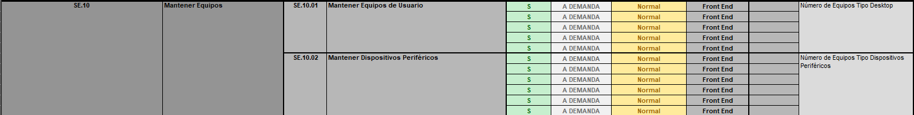
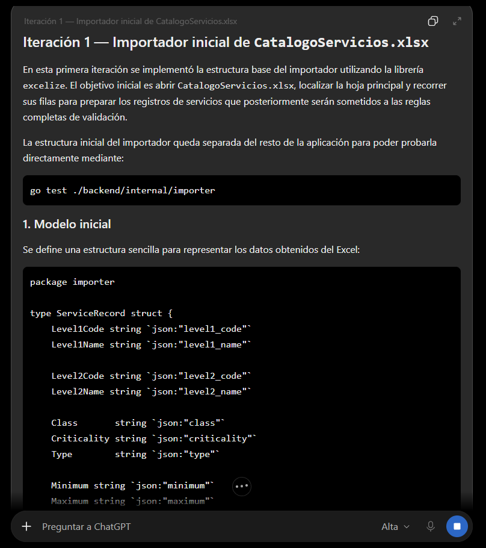
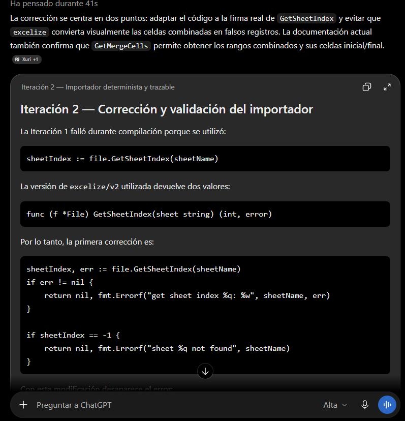

# Evidencia: primer ciclo del importador

Fecha del ciclo: 2026-10-01

Fecha de incorporación de las capturas visuales: 2026-10-02

Herramienta: Codex desktop.

Modelo: GPT-5.6 Sol.

Modo: High.

## Entorno

- Desarrollo: computadora local.
- Verificación: laptop `fedora` mediante SSH.
- Ejecución: contenedor `golang:1.24` con Podman compatible con Docker.
- Montaje de archivos en Fedora: se requiere la etiqueta SELinux `:Z`.

## Ciclo registrado

1. Tarea: construir un importador que respete celdas combinadas, conflicto `SE.12`, valores desconocidos y controles 12/46.
2. Cambio propuesto por IA: crear el paquete `backend/internal/importer` y sus pruebas.
3. Control ejecutado: `go test ./backend/internal/importer`.
4. Fallo detectado: `GetSheetIndex` fue utilizado como retorno único.
5. Corrección: manejar el índice y el error devueltos por la API.
6. Próximo control: repetir las pruebas después de sincronizar la corrección.

## Texto de las iteraciones

### Iteración 1

Actúa como analista de datos y desarrollador de un importador para catálogos de servicios de TI.

Construye un importador para `CatalogoServicios.xlsx` que genere los registros del catálogo con sus códigos, nombres y atributos.

El archivo contiene información de servicios de nivel 1 y nivel 2. La primera versión debe leer la hoja principal y preparar los datos para las pruebas del proyecto.

Usa como entrada el archivo Excel, la hoja del catálogo y la librería `excelize` utilizada por el proyecto.

Entrega el código del importador y ejecuta `go test ./backend/internal/importer` para comprobarlo.

El resultado inicial debe compilar y permitir continuar con la validación del catálogo.

### Problema observado

La primera ejecución falló porque `GetSheetIndex` fue utilizado como si devolviera un solo valor. La versión de la dependencia devuelve el índice de la hoja y un error, por lo que el código no compiló.

### Iteración 2

Actúa como analista de datos y desarrollador de un importador con reglas deterministas y trazabilidad completa.

Corrige el importador y define reglas para las celdas combinadas, el conflicto `SE.12`, los códigos `SE.12.1`, `SE.12.2` y `SE.12.3`, los atributos incompletos, las filas de continuación, las listas de opciones y la trazabilidad.

El archivo original no debe modificarse. La solución debe conservar los nombres fuente, tratar los valores faltantes como desconocidos y evitar crear servicios a partir de filas que no correspondan a registros.

Usa como entrada `CatalogoServicios.xlsx`, la hoja con datos en `A4:L101`, las listas de opciones en `E112:H122` y la documentación de la API de `excelize`. Maneja correctamente los dos valores que devuelve `GetSheetIndex`.

Entrega reglas numeradas, código corregido, pruebas del importador y un reporte JSON con conteos, observaciones y trazabilidad.

El resultado se acepta si `go test ./...` finaliza correctamente, se conservan 12 códigos de nivel 1 y 46 servicios de nivel 2, se documenta el conflicto `SE.12` y se conservan ambos nombres originales.

## Capturas de las iteraciones

- 
- 
- 
- 
- 
- 
- 
- 

Durante la generación del primer reporte se observó que la advertencia del conflicto sí se generaba, pero la lista de valores de origen del registro canónico no conservaba el segundo nombre. Se agregó una prueba específica y se corrigió la actualización del registro en el reporte.

El archivo original `data/CatalogoServicios.xlsx` se utiliza como entrada y no se modifica.
