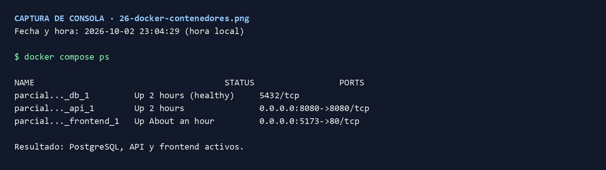
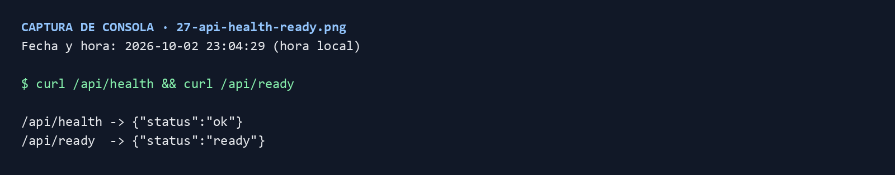
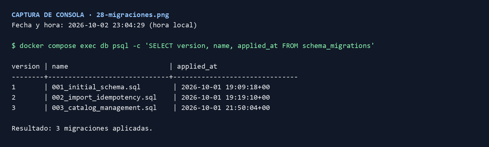
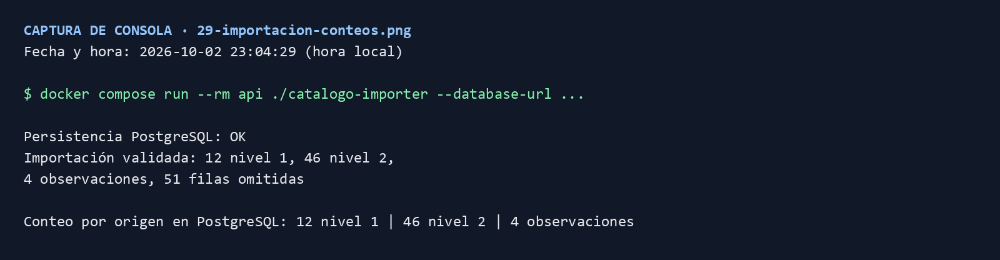
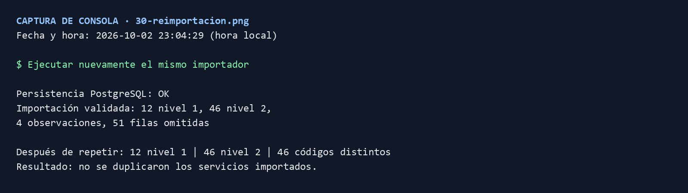
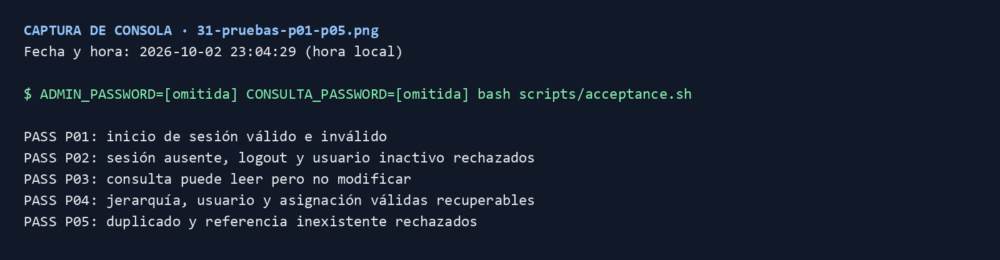
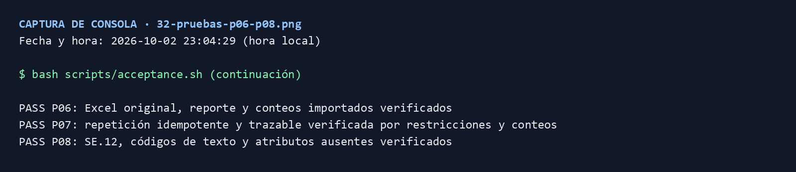
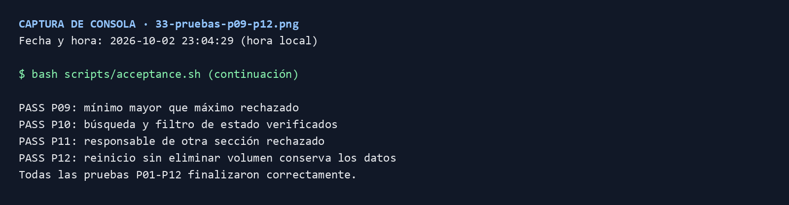
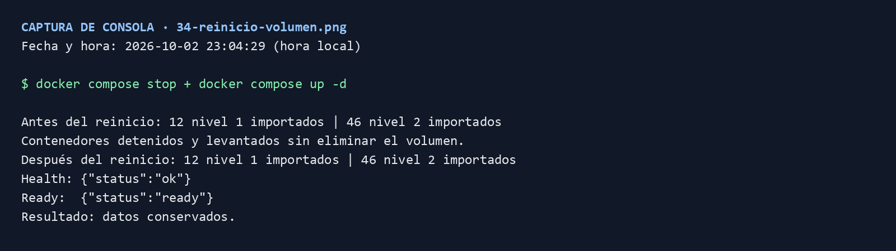

# Evidencias de consola: Docker, importación y pruebas

Estas evidencias fueron ejecutadas en la laptop remota `192.168.1.23` el 2 de octubre de 2026. Las imágenes muestran la salida de consola real con fecha y hora local.

## Docker y API

- 
- 
- 

## Importación e idempotencia

- 
- 

La importación produjo 12 servicios de nivel 1, 46 de nivel 2, 4 observaciones y 51 filas omitidas. La segunda ejecución mantuvo 46 códigos distintos de nivel 2.

## Suite de aceptación

- 
- 
- 

Las doce pruebas finalizaron con `PASS`.

## Persistencia del volumen

- 

Se detuvieron y levantaron los servicios sin eliminar el volumen. Los conteos permanecieron en 12 nivel 1 y 46 nivel 2. Además, `/api/health` y `/api/ready` respondieron correctamente.
