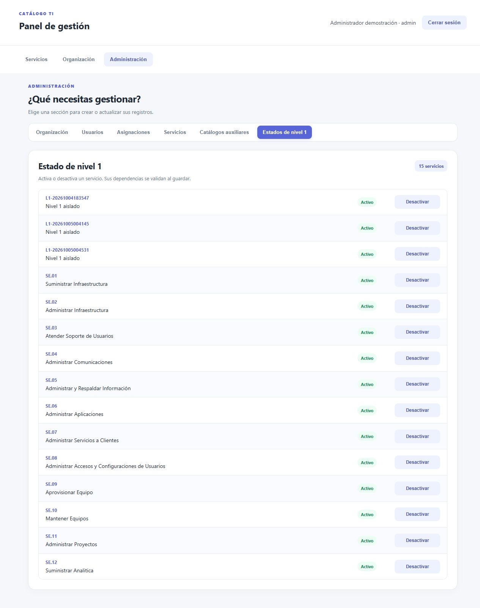
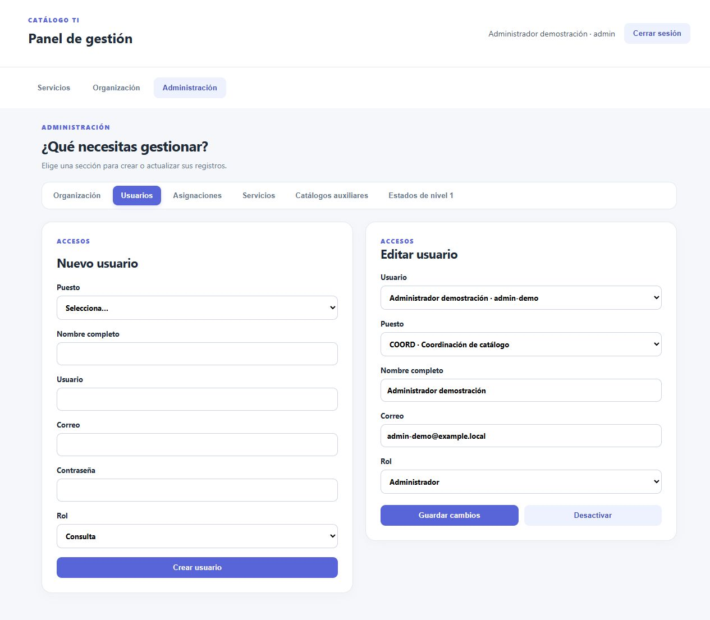
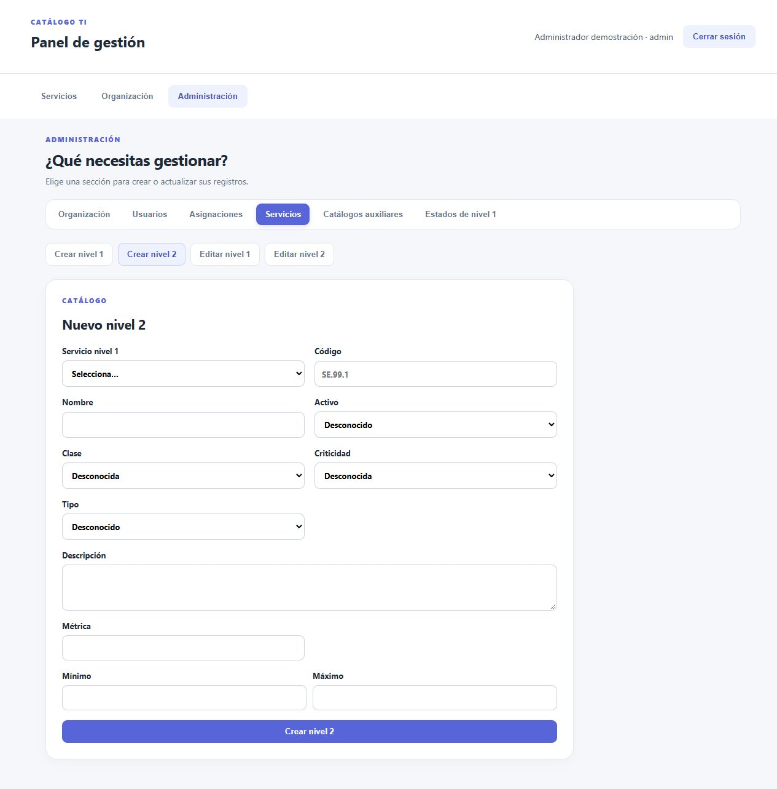
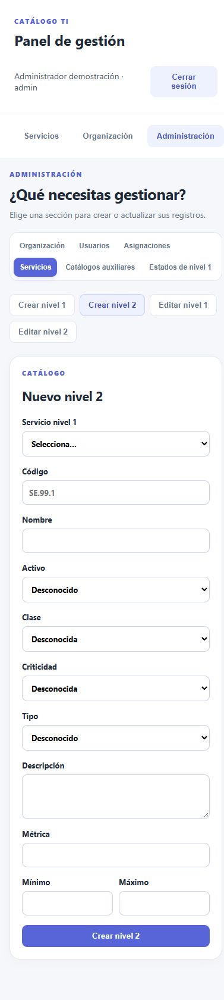

# Cierre de auditoría

Fecha: 2026-10-04, zona America/Guatemala. Integrante: Jeremy Estuardo Orellana Aldana, carné 202300644.

Estado de Git al comenzar: `main` y tag remoto `parcial-v2.0` apuntaban a `751dbd8e19358e260f9d61c2869cc79b14140ea3`. Las modificaciones de este cierre se verificaron como cambios locales sobre esa base. No se atribuyen a un SHA nuevo hasta que el integrante haga commit.

## Cambios comprobados

- Catálogos de clase, criticidad y tipo con alta, consulta, modificación y eliminación de opciones sin uso. Las etiquetas utilizadas por servicios importados no se renombran y las referencias desconocidas se rechazan en la API.
- Nivel 1 activo e inactivo consultable, con controles para desactivar y reactivar en Administración. La API rechaza desactivar con hijos activos.
- Navegación de servicios en páginas de doce resultados y filtros de servidor.
- Importación serializada en una transacción que calcula creados y actualizados y reescribe el reporte después de persistir.
- Seed que importa el Excel antes de crear organización, usuarios y tres asignaciones.
- P02 usa un usuario aislado. P06 verifica el reporte actual. P07 comprueba cero creados y 58 actualizados. P09 prueba creación y edición inválidas. P10 verifica filtros por nivel 1, clase, criticidad y tipo. P12 recupera el servicio creado durante la suite.
- Se rechaza mover un usuario responsable a un puesto de otra sección y desactivar secciones con servicios asignados.
- Runner con dependencias dentro del contenedor, probado usando el socket de Podman.

## Controles locales

Comandos desde la raíz del repositorio:

```text
go test ./...                 PASS
go vet ./...                  PASS
npm --prefix frontend run build  PASS
git diff --check              PASS
```

Las pruebas Go cubren el importador y la validación de rango y activo del catálogo. La suite remota cubre contratos de API y persistencia. El build comprueba compilación de React, no sustituye una prueba visual del navegador.

## Ciclo real del runner

1. Tarea: ejecutar la suite desde un contenedor sin instalar lenguajes en el anfitrión.
2. Cambio: añadir `tests/Dockerfile` y el comando con socket del motor.
3. Primer control: pasó P01–P05 y falló por una etiqueta de red incompatible entre Docker Compose y Podman Compose.
4. Primer ajuste: ejecutar el importador dentro de la API existente. Persistió una incompatibilidad de detección de servicios.
5. Corrección definitiva: localizar IDs de los contenedores de este proyecto y usar comandos del motor para ejecución y reinicio.
6. Nueva ejecución: todos los escenarios P01–P12 y EXTRA pasaron, código de salida 0.

Los fallos fueron reales y no se introdujeron deliberadamente. Se reconstruyeron contenedores sin eliminar el volumen PostgreSQL.

Comando satisfactorio en la laptop:

```bash
docker run --rm --network host --security-opt label=disable \
  -v /run/user/$(id -u)/podman/podman.sock:/var/run/docker.sock \
  -v "$PWD:$PWD" -w "$PWD" \
  -e ADMIN_PASSWORD='clave-local-admin' \
  -e CONSULTA_PASSWORD='clave-local-consulta' \
  catalogo-tests
```

Extracto seleccionado de la salida real, no captura de pantalla:

La [salida completa de la suite](2026-10-04-salida-pruebas.txt) fue generada con `tee` durante la última ejecución en la laptop y copiada al repositorio sin reconstruir su contenido.

```text
PASS P01: inicio de sesión válido e inválido
PASS P02: sesión ausente, logout y usuario inactivo rechazados
PASS P03: consulta puede leer pero no modificar
PASS P04: jerarquía, usuario y asignación válidas recuperables
PASS P05: duplicado y referencia inexistente rechazados
PASS P06: Excel original, reporte y conteos importados verificados
PASS P07: repetición idempotente y trazable verificada por restricciones y conteos
PASS P08: SE.12, códigos de texto y atributos ausentes verificados
PASS P09: mínimo mayor que máximo rechazado
PASS P10: búsqueda y filtro de estado verificados
PASS P11: responsable de otra sección rechazado
PASS EXTRA: CRUD de opciones, referencias controladas y estado nivel 1
PASS P12: reinicio sin eliminar volumen conserva los datos
Todas las pruebas P01-P12 finalizaron correctamente.
```

## Evidencias y límites

El seed también se ejecutó sobre una base vacía aislada `audit_20261004`, mediante `createdb` dentro de PostgreSQL y `catalogo-seed` con `DATABASE_URL` apuntando a esa base. No se reinicializó la base de evaluación. Resultado SQL:

```text
nivel1 | nivel2 | asignaciones | creados | actualizados
12     | 46     | 3            | 58      | 0
```

El proxy del frontend devolvió `{"status":"ready"}` después de esa comprobación.

Las imágenes 24 a 34 se identifican como representaciones de transcripciones. Las instrucciones nuevas y las dos mejoras están en [prompt 007](../prompts/007-iteraciones-cierre-auditoria.md). El [diccionario y mapeo](../decisiones/diccionario-y-mapeo.md) completa el detalle del modelo.

La validación actual no constituye una prueba automatizada del navegador. La consulta de permisos de `maldanap-usac` mediante la integración de GitHub devolvió HTTP 403, `Resource not accessible by integration`. Eso no demuestra que el colaborador no tenga acceso, sino que la integración no puede consultar ese dato. Confirmarlo en la configuración del repositorio. La entrega necesita publicar este cierre y mover el tag al commit nuevo.

SHA-256 del Excel verificado localmente: `DE3B478A5FAEEEAEBCE1AA7726E0E3321188A68E41BBB656E1D17B0C5B74DCF0`. El original no presenta cambios en Git.

## Revisión visual de Administración

Se reorganizó Administración en secciones de Organización, Usuarios, Asignaciones, Servicios, Catálogos auxiliares y Estados de nivel 1. Crear y editar servicios tienen operaciones separadas. Los formularios de nivel 2 distribuyen sus campos en dos columnas en escritorio y una en pantallas pequeñas. Los estados usan filas delimitadas, indicadores de estado y botones de tamaño uniforme.

La compilación del frontend pasó y la versión se desplegó en la laptop. Se verificaron manualmente las vistas de usuarios, servicios y estados con sesión de administrador. En un ancho de 390 píxeles se comprobó que el documento no excediera el ancho disponible. Esta revisión visual no sustituye una suite automatizada de navegador ni incluye guardar registros nuevos.

Las siguientes imágenes son capturas reales del navegador, no reconstrucciones. Los registros adicionales de prueba que aparecen en los selectores y estados se conservaron.








