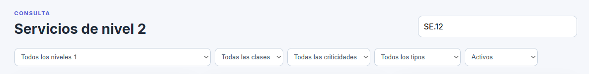
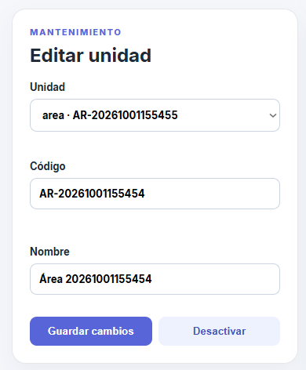
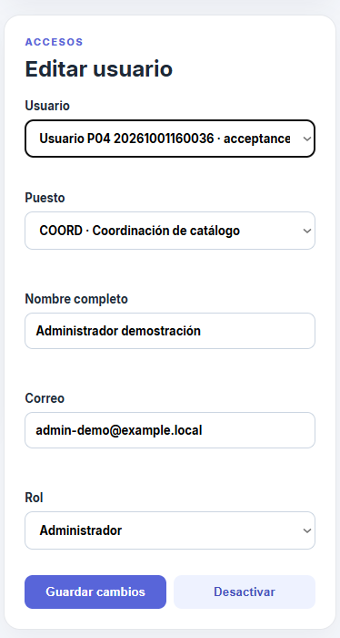
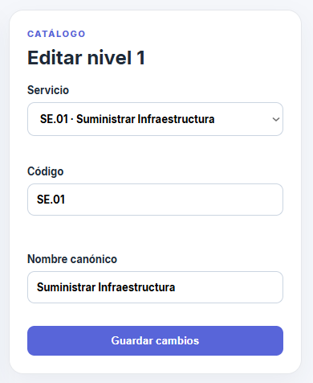

# Evidencia del ciclo CRUD y pruebas de aceptación

Fecha: 2026-10-01  
Entorno: laptop `192.168.1.23`, Podman compatible con Docker, PostgreSQL 18,
API Go y frontend React/Nginx.

## Cambios verificados

- Migración 003 aplicada sin eliminar el volumen `catalogo_pgdata`.
- API reconstruida con CRUD de nivel 1 y nivel 2, búsqueda y filtros.
- Imagen de API con el importador disponible para pruebas reproducibles.
- Frontend reconstruido con filtros por texto, nivel 1, clase, criticidad,
  tipo y estado.
- Formularios administrativos reconstruidos para editar unidades, usuarios,
  nivel 1 y nivel 2, además de activar o desactivar registros.
- Conteos conservados: 12 códigos de nivel 1 y 46 servicios de nivel 2.
- `SE.12.1`, `SE.12.2` y `SE.12.3` permanecen como texto.
- Los tres servicios incompletos mantienen atributos nulos y revisión requerida.

## Prueba automatizada

Comando utilizado en la laptop:

```bash
ADMIN_PASSWORD='(variable local)' \
CONSULTA_PASSWORD='(variable local)' \
BASE_URL=http://127.0.0.1:8080 \
bash scripts/acceptance.sh
```

Resultado observado:

```text
PASS P01 ...
PASS P02 ...
PASS P03 ...
PASS P04 ...
PASS P05 ...
PASS P06 ...
PASS P07 ...
PASS P08 ...
PASS P09 ...
PASS P10 ...
PASS P11 ...
PASS P12 ...
Todas las pruebas P01-P12 finalizaron correctamente.
```

P04 creó una jerarquía aislada, un usuario y servicios de prueba. P06 y P07
ejecutaron dos veces el importador contra el mismo volumen y no generaron
duplicados. P11 intentó
usar ese usuario desde una sección distinta y recibió rechazo del servidor.
P12 reinició los contenedores sin `down -v`. Después del reinicio `/api/health`
y `/api/ready` respondieron correctamente y los conteos permanecieron.

Durante el reinicio, Podman mostró advertencias de dependencias detenidas. No
se eliminaron contenedores de base ni el volumen. El servicio se recuperó y la
prueba terminó aprobada.

## Capturas del CRUD y mantenimiento

- 
- 
- 
- 
