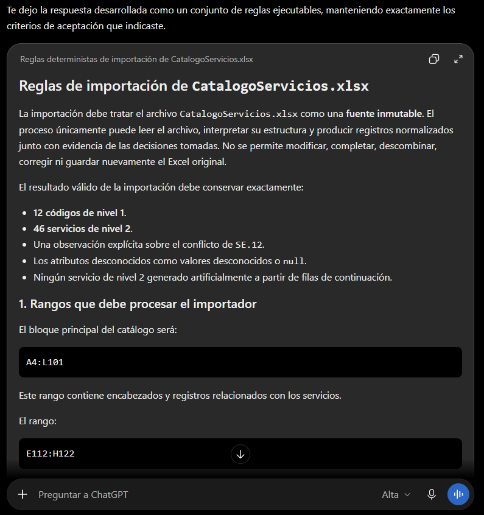

# Prompt 001: diseño del importador y trazabilidad

Fecha de uso: 2026-10-01

Herramienta: Codex desktop.

Modelo: GPT-5.6 Sol.

Modo: High.

## Prompt utilizado

Actúa como analista de datos y diseñador de reglas de importación para un catálogo de servicios de TI.

Relee la consigna completa y define reglas ejecutables y deterministas para importar `CatalogoServicios.xlsx` sin perder información ni trazabilidad.

Considera las celdas combinadas, el conflicto `SE.12`, los códigos `SE.12.1`, `SE.12.2` y `SE.12.3`, los atributos incompletos, las filas de continuación y las listas de opciones. El archivo original no debe modificarse.

Usa como entrada la hoja con datos en `A4:L101`, las listas de opciones en `E112:H122` y las reglas obligatorias de la tarea.

Entrega reglas numeradas, supuestos explícitos, tratamiento de cada incidencia, campos de trazabilidad, conteos esperados y una propuesta de reporte JSON.

El resultado se acepta únicamente si conserva 12 códigos de nivel 1, 46 servicios de nivel 2, una observación del conflicto `SE.12`, los valores desconocidos sin inventarlos y ningún servicio creado automáticamente desde filas de continuación.

## Captura del prompt

## Respuesta aplicada

- Se identificó `A4:L101` como rango de encabezados y datos, y `E112:H122` como listas de opciones.
- Solo una fila con `COD.N2` físico o principal de una combinación crea un servicio nivel 2.
- Las celdas combinadas se resuelven desde su celda principal, sin relleno global.
- El padre se obtiene del prefijo del código nivel 2.
- `SE.12` conserva `Suministrar Analitica` como primer valor canónico y registra el segundo nombre como conflicto.
- Los atributos vacíos de las filas 99 a 101 permanecen desconocidos y requieren revisión.
- Las filas de continuación y las opciones se excluyen y se registran.
- Cada registro conserva hoja, fila, rango y transformaciones.

## Iteración de verificación

El primer intento de compilación en la laptop falló porque la llamada a `GetSheetIndex` se trató como si devolviera un solo valor. La documentación de la dependencia devuelve `(int, error)`. Se corrigió la llamada para manejar ambos valores y se repite la prueba.
