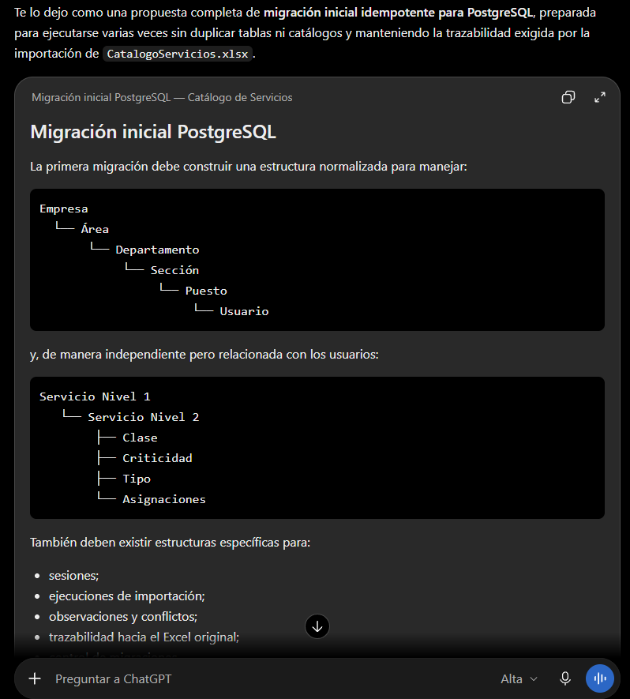

# Prompt 002: esquema y persistencia

Fecha de uso: 2026-10-01

Herramienta: Codex desktop.

Modelo: GPT-5.6 Sol.

Modo: High.

## Prompt utilizado

Actúa como arquitecto de datos especializado en PostgreSQL y diseño de esquemas relacionales.

Diseña la migración inicial para el sistema de catálogo de servicios y define las relaciones, restricciones, reglas de persistencia y campos de trazabilidad necesarios.

El sistema debe manejar la jerarquía Empresa–Área–Departamento–Sección–Puesto–Usuario, los servicios de nivel 1 y nivel 2, los catálogos controlados, las asignaciones, las sesiones y las importaciones repetibles.

Usa como entrada la consigna de la tarea, las reglas de importación del Excel, los campos conocidos del catálogo y los campos de origen que deben conservarse. Incluye la validación `mínimo <= máximo`.

Entrega las tablas, claves primarias y foráneas, restricciones de unicidad, bajas lógicas, campos de trazabilidad y sentencias SQL que puedan ejecutarse de forma repetible.

La migración se acepta si puede ejecutarse varias veces sin duplicar tablas ni catálogos, conserva los valores desconocidos como `NULL` y permite que el servidor responda en `/api/ready`.

## Captura del prompt

## Respuesta aplicada

- Se creó una migración inicial normalizada.
- Los códigos de servicios son únicos.
- Los catálogos de clase, criticidad y tipo se cargan como opciones controladas.
- Los atributos faltantes permanecen nulos.
- Las importaciones tienen ejecución y observaciones trazables.
- Las sesiones almacenan el hash del token, no el token en texto plano.
