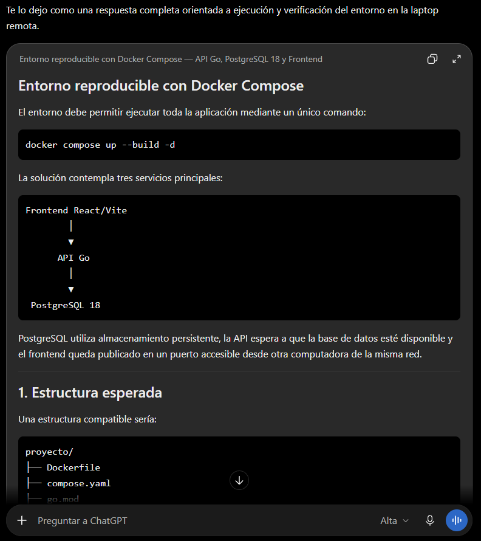

# Prompt 003: Docker y persistencia PostgreSQL

Fecha de uso: 2026-10-01

Herramienta: Codex desktop.

Modelo: GPT-5.6 Sol.

Modo: High.

## Prompt utilizado

Actúa como ingeniero DevOps responsable de preparar un entorno reproducible para desarrollo y evaluación.

Prepara un entorno con Docker Compose para la API Go, PostgreSQL 18 y el frontend, garantizando disponibilidad, persistencia y diagnóstico del arranque.

La aplicación debe ejecutarse en la laptop remota y ser accesible desde otra computadora. La base de datos debe persistir mediante un volumen y la API debe esperar a que PostgreSQL esté disponible.

Usa como entrada el código fuente, las migraciones PostgreSQL, la configuración React/Vite y las restricciones de red, puertos y acceso de la laptop remota.

Entrega el `Dockerfile`, `compose.yaml`, healthcheck, volumen, puertos, comandos de arranque y una bitácora de fallos y correcciones observadas durante la prueba remota.

El resultado se acepta si `docker compose up --build -d` termina correctamente, la API arranca después de la base, `/api/health` y `/api/ready` responden correctamente y los datos sobreviven a un reinicio sin eliminar el volumen.

## Captura del prompt

## Respuesta aplicada

- Se creó un `Dockerfile` multi-etapa para compilar el servidor Go.
- Se creó `compose.yaml` con API, PostgreSQL, healthcheck y volumen.
- La primera ejecución mostró que PostgreSQL 18 requiere montar el volumen en `/var/lib/postgresql`.
- Se corrigió la ruta, se repitió la ejecución desde un volumen de prueba limpio y ambos servicios arrancaron correctamente.
- La API respondió `/api/health` y `/api/ready`. Después se comprobó la aplicación de dos migraciones.
