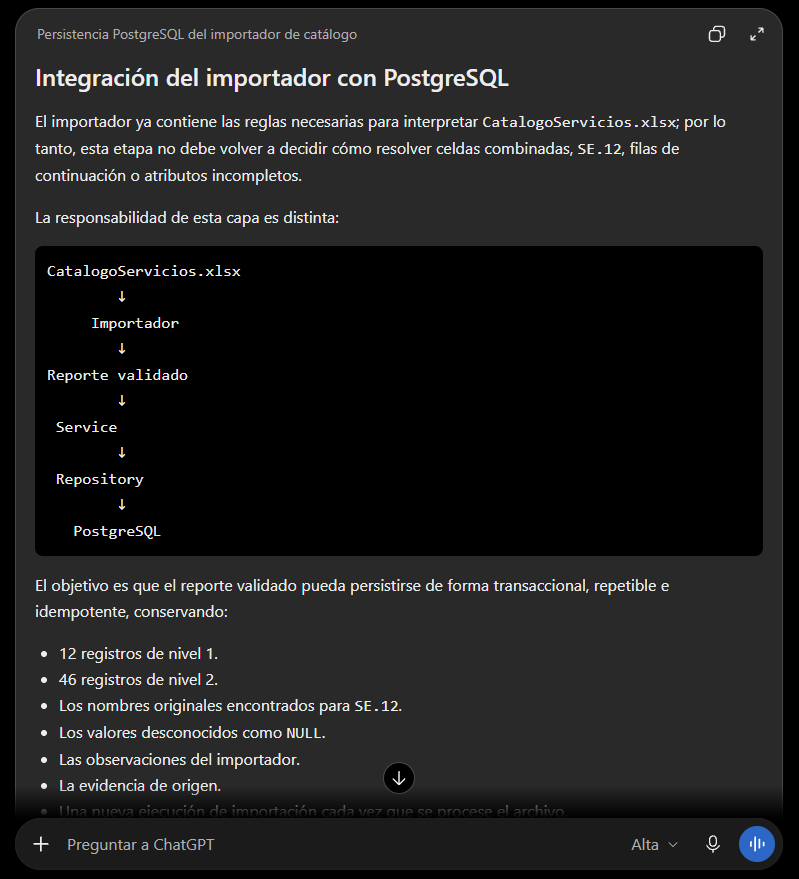

# Prompt 004: persistencia del catálogo importado

Fecha de uso: 2026-10-01

Herramienta: Codex desktop.

Modelo: GPT-5.6 Sol.

Modo: High.

## Prompt utilizado

Actúa como desarrollador backend Go con experiencia en arquitectura Service y Repository y persistencia PostgreSQL.

Conecta el importador validado con PostgreSQL para guardar el catálogo, sus evidencias de origen, observaciones y ejecuciones de importación sin duplicar registros.

El importador ya resuelve las reglas del Excel. La persistencia debe conservar los niveles 1 y 2, los nombres originales de `SE.12`, los campos desconocidos como `NULL` y la trazabilidad de cada ejecución.

Usa como entrada el reporte producido por el importador, el esquema y las migraciones PostgreSQL, la arquitectura existente y la URL de conexión de Docker.

Entrega los cambios de servicio, repositorio, migraciones y comando de importación, junto con un reporte JSON de creados, actualizados, omitidos y observados.

El resultado se acepta si la primera ejecución persiste 12 nivel 1 y 46 nivel 2, la segunda es idempotente, conserva 46 códigos distintos y mantiene la trazabilidad completa.

## Captura del prompt



## Respuesta aplicada

- Se agregó un repositorio de persistencia para `services_level1`, `services_level2`, nombres fuente, observaciones e importaciones.
- Se agregó un servicio que rechaza reportes con errores de validación antes de persistirlos.
- Se agregaron migraciones para la evidencia de origen y la idempotencia de nombres fuente.
- El comando mantiene su reporte JSON y acepta `--database-url` para persistir el resultado.

## Resultado comprobado

```text
Persistencia PostgreSQL: OK
12 servicios nivel 1
46 servicios nivel 2
4 observaciones
1 importación exitosa
```
