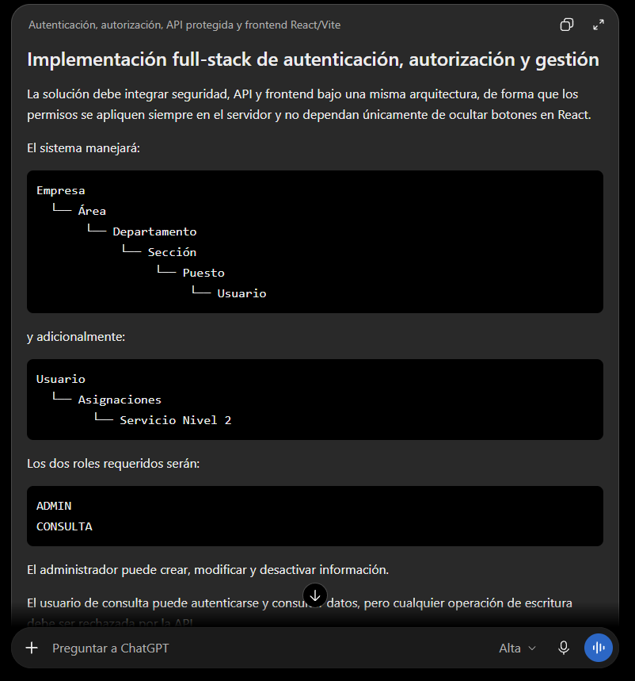

# Prompt 005: autenticación, organización e interfaz

Fecha de uso: 2026-10-01

Herramienta: Codex desktop.

Modelo: GPT-5.6 Sol.

Modo: High.

## Prompt utilizado

Actúa como desarrollador full-stack responsable de la seguridad, la API y la experiencia de usuario.

Implementa autenticación local con bcrypt, sesiones invalidables, roles administrador y consulta y protección en el servidor.

El sistema debe manejar la jerarquía Empresa–Área–Departamento–Sección–Puesto, usuarios y asignaciones de servicios. También debe validar padres activos y asegurar que los responsables pertenezcan a la sección seleccionada.

Usa como entrada el esquema PostgreSQL, la API Go, las reglas de autorización, las cuentas de demostración, el frontend React/Vite y la configuración Docker Compose.

Entrega endpoints protegidos, seed de demostración, pantallas React/Vite, validaciones y comandos para levantar y probar el sistema desde otra computadora.

El resultado se acepta si el administrador puede mantener la información, el usuario de consulta puede leer sin modificar, los accesos inválidos se rechazan y la interfaz funciona mediante la IP del host remoto.

## Captura del prompt



## Respuesta aplicada

- Se implementó el servicio de autenticación y el seed local de cuentas de demostración.
- Se agregaron endpoints protegidos para organización, usuarios, consulta de servicios y asignaciones.
- Se validan roles, padres activos y pertenencia del responsable a la sección.
- Se creó una interfaz React/Vite con login, búsqueda, organización, usuarios y asignaciones.
- Se agregó Nginx como proxy `/api` para que el frontend funcione mediante la IP del host remoto.

## Resultado comprobado

```text
API y PostgreSQL: activos
Frontend: HTTP 200
Login válido: HTTP 200
Login inválido: HTTP 401
Rol consulta intentando modificar: HTTP 403
Logout y reutilización de sesión: HTTP 204 y luego HTTP 401
Asignaciones de demostración: 3
```
