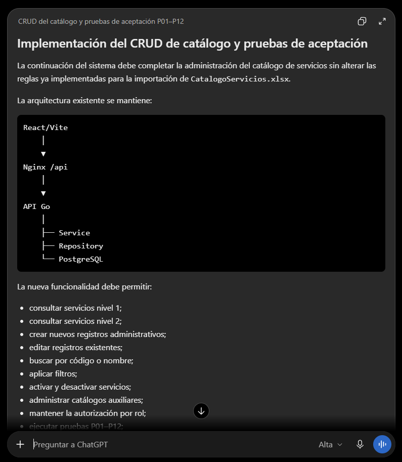

# Prompt 006: CRUD, filtros y pruebas de aceptación

Fecha de uso: 2026-10-01

Herramienta: Codex desktop.

Modelo: GPT-5.6 Sol.

Modo: High.

## Prompt utilizado

Actúa como desarrollador full-stack y responsable de pruebas de aceptación del sistema.

Continúa con la implementación y completa el CRUD del catálogo de servicios de nivel 1 y nivel 2. Agrega búsqueda, filtros, activación y desactivación.

La aplicación ya cuenta con autenticación, organización, importación persistente e interfaz React/Vite. Las pruebas se ejecutarán en Docker sobre una base con datos de evaluación que no debe destruirse.

Usa como entrada el código existente de la API Go, el frontend React, PostgreSQL, las reglas de importación, la matriz P01–P12 y las credenciales de evaluación mediante variables de entorno.

Entrega endpoints, formularios, validaciones y un script reproducible que reporte cada escenario como `PASS` o `FAIL` sin exponer contraseñas.

El resultado se acepta si P01–P12 finalizan correctamente, la importación repetida no duplica, los permisos y relaciones se validan, permanecen 12 nivel 1 y 46 nivel 2 y los datos sobreviven a un reinicio sin eliminar volúmenes.

## Captura del prompt

## Respuesta aplicada

- Se agregó la migración `003_catalog_management.sql` con el estado activo del
  servicio nivel 2 e índice de consulta.
- Se incorporaron repositorio y handlers para nivel 1, nivel 2, catálogos de
  apoyo, búsqueda, filtros y activación/desactivación.
- La interfaz React ahora permite buscar, filtrar y crear registros de catálogo.
- La interfaz también permite editar y activar/desactivar unidades, usuarios y
  servicios desde formularios administrativos.
- La imagen de la API incluye el importador y `scripts/acceptance.sh` automatiza
  P01–P12 usando credenciales por variables de entorno y datos con prefijo
  propio. P06 y P07 ejecutan el importador dos veces.
- La validación remota comprobó que permanecen los 12 nivel 1, los 46 nivel 2,
  el conflicto de `SE.12` y los atributos desconocidos.
